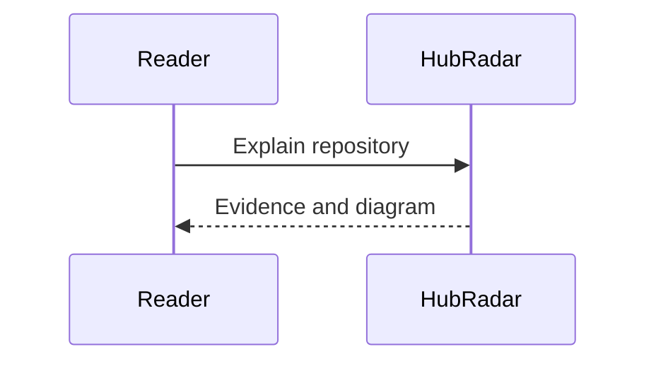
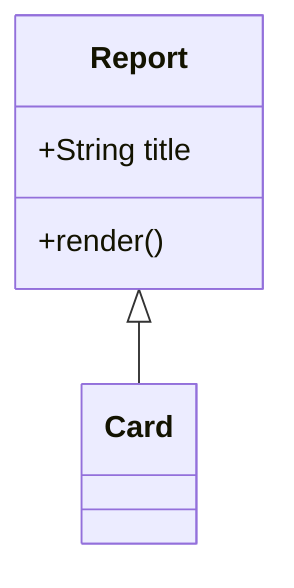
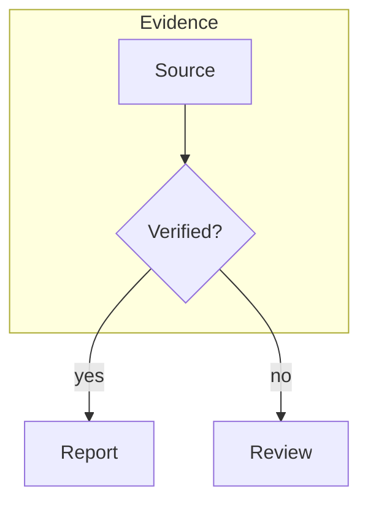

# Mermaid 内核回归

## 时序图

```mermaid
sequenceDiagram
    participant A as Reader
    participant B as HubRadar
    A->>B: Explain repository
    B-->>A: Evidence and diagram
```

## 类图

```mermaid
classDiagram
    Report <|-- Card
    Report : +String title
    Report : +render()
```

## 子图与条件节点

```mermaid
flowchart TD
    subgraph Evidence
      A[Source] --> B{Verified?}
    end
    B -->|yes| C[Report]
    B -->|no| D[Review]
```
